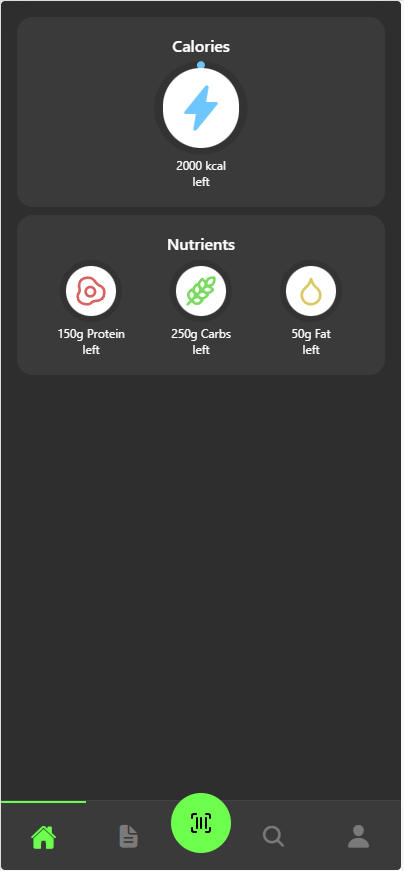

# Food Logger — Expo



Een mobiele food tracking applicatie gebouwd met Expo (React Native), waarin gebruikers producten kunnen scannen, zoeken en loggen.  
De applicatie maakt gebruik van een eigen backend API, de OpenFoodFacts database en een PostgreSQL database voor opslag.  
Dit project laat mijn vaardigheden zien op het gebied van mobile development, API-integratie en full-stack architectuur.  
Het project is ontwikkeld als onderdeel van mijn HBO-ICT opleiding.

---

## Live Demo

- Live App: https://food-logger-app--vly443793q.expo.app/  
- GitHub Repository: https://github.com/Maarten0162/Expo-Food-Logger  

---

## Overzicht

Het Food Logger project is gemaakt om:

- Mobile development vaardigheden te demonstreren met React Native  
- Te werken met barcode scanning en device API’s  
- Een eigen backend te integreren met een mobiele applicatie  
- Data op te slaan en te verwerken in een PostgreSQL database  
- Usability en iteratief ontwerpen toe te passen  

De applicatie is gericht op gebruikers die hun voeding willen bijhouden en gemotiveerd willen blijven door inzicht en gamified elementen.

---

## Functionaliteiten

### Barcode Scannen
Gebruikers kunnen producten scannen via de camera van hun mobiele apparaat.  
De barcode wordt gebruikt om productinformatie op te halen via de OpenFoodFacts API.

---

### Product Zoeken
Producten kunnen handmatig worden gezocht via een zoekscherm.  
Zoekresultaten worden opgehaald vanuit de OpenFoodFacts database.

---

### Voeding Loggen
Gebruikers kunnen producten toevoegen aan een specifiek moment van de dag (ontbijt, lunch, diner en snacks).  
De voedingswaarden schalen automatisch mee op basis van de ingevoerde hoeveelheid.

---

### Dagoverzicht (Diary)
De gebruiker krijgt een overzicht van alle gelogde producten per dag en per maaltijdmoment.  
Hierdoor is direct inzichtelijk hoeveel calorieën en macro’s zijn geconsumeerd.

---

### Backend Integratie
De mobiele applicatie communiceert met een eigen Node.js backend API.  
Deze backend verwerkt requests en slaat logdata op in een PostgreSQL database (Neon).

---

## Gebruikte Technologieën

- Framework: Expo (React Native)  
- Taal: TypeScript  
- Backend: Node.js (Express)  
- Database: PostgreSQL (Neon)  
- Externe API: OpenFoodFacts  
- Hosting Backend: Vercel  

---

## Geïnstalleerde Packages

- Expo  
- React Native  
- Axios  
- TypeScript  
- ESLint  

---

## Bestandsstructuur

```txt
Expo-Food-Logger/
├── .gitattributes
├── .gitignore
├── .vscode/
│   ├── extensions.json
│   └── settings.json
├── app/
│   ├── _layout.tsx
│   ├── components/
│   │   ├── cards/
│   │   │   ├── caloriesCard.tsx
│   │   │   ├── macroItem.tsx
│   │   │   ├── mealSelection.tsx
│   │   │   └── nutrientsCard.tsx
│   │   ├── navigation/
│   │   │   ├── BottomNavBar.tsx
│   │   │   ├── DateSelector.tsx
│   │   │   ├── NavItem.tsx
│   │   │   └── types.ts
│   │   ├── screens/
│   │   │   ├── AddFood.tsx
│   │   │   ├── diary.tsx
│   │   │   ├── foodDetail.tsx
│   │   │   ├── home.tsx
│   │   │   ├── profile.tsx
│   │   │   ├── scanner.tsx
│   │   │   ├── ScreenRenderer.tsx
│   │   │   ├── search.tsx
│   │   │   └── types.ts
│   │   ├── testUser.ts
│   │   └── ui/
│   │       ├── card.tsx
│   │       └── sectionCard.tsx
│   ├── food-detail/
│   │   └── [product].tsx
│   ├── FoodContext.tsx
│   ├── FoodFlowProvider.tsx
│   ├── GoalsContext.tsx
│   ├── index.tsx
│   ├── ProgressContext.tsx
│   ├── scanner/
│   │   └── index.tsx
│   ├── ScreenContext.tsx
│   └── theme/
│       └── color.ts
├── app.json
├── assets/
│   └── images/
│       ├── android-icon-background.png
│       ├── android-icon-foreground.png
│       ├── android-icon-monochrome.png
│       ├── favicon.png
│       ├── GitBannerFoodlogger.png
│       ├── icon.png
│       ├── leafy-green.png
│       ├── leafy-green.svg
│       ├── partial-react-logo.png
│       ├── react-logo.png
│       ├── react-logo@2x.png
│       ├── react-logo@3x.png
│       └── splash-icon.png
├── eas.json
├── eslint.config.js
├── package-lock.json
├── package.json
├── README.md
└── tsconfig.json
```

---

## InstaInstallatie

```bash
# Clone de repository
git clone https://github.com/Maarten0162/Expo-Food-Logger.git

# Ga naar de projectmap
cd Expo-Food-Logger

# Installeer dependencies
npm install

# Start de development server
npx expo start
```

---

## License
MIT License

Copyright (c) 2026 Maarten van den Berg

Permission is hereby granted, free of charge, to any person obtaining a copy
of this software and associated documentation files (the "Software"), to deal
in the Software without restriction, including without limitation the rights
to use, copy, modify, merge, publish, distribute, sublicense, and/or sell
copies of the Software, and to permit persons to whom the Software is
furnished to do so, subject to the following conditions:

The above copyright notice and this permission notice shall be included in all
copies or substantial portions of the Software.

THE SOFTWARE IS PROVIDED "AS IS", WITHOUT WARRANTY OF ANY KIND, EXPRESS OR
IMPLIED, INCLUDING BUT NOT LIMITED TO THE WARRANTIES OF MERCHANTABILITY,
FITNESS FOR A PARTICULAR PURPOSE AND NONINFRINGEMENT. IN NO EVENT SHALL THE
AUTHORS OR COPYRIGHT HOLDERS BE LIABLE FOR ANY CLAIM, DAMAGES OR OTHER
LIABILITY, WHETHER IN AN ACTION OF CONTRACT, TORT OR OTHERWISE, ARISING FROM,
OUT OF OR IN CONNECTION WITH THE SOFTWARE OR THE USE OR OTHER DEALINGS IN THE
SOFTWARE.

---
